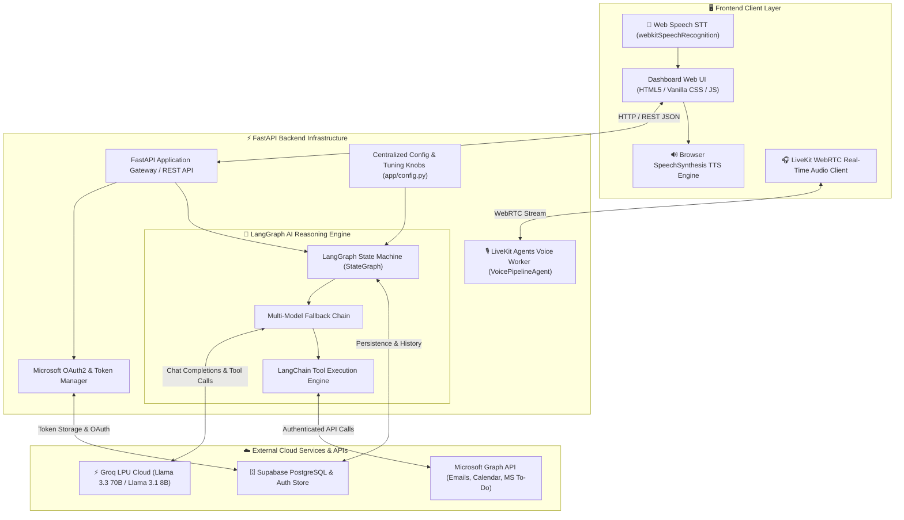
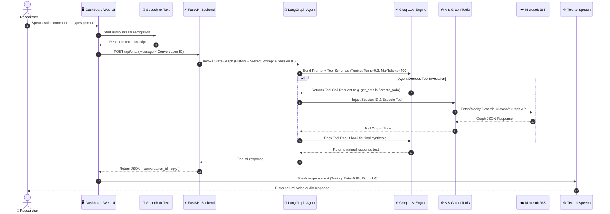
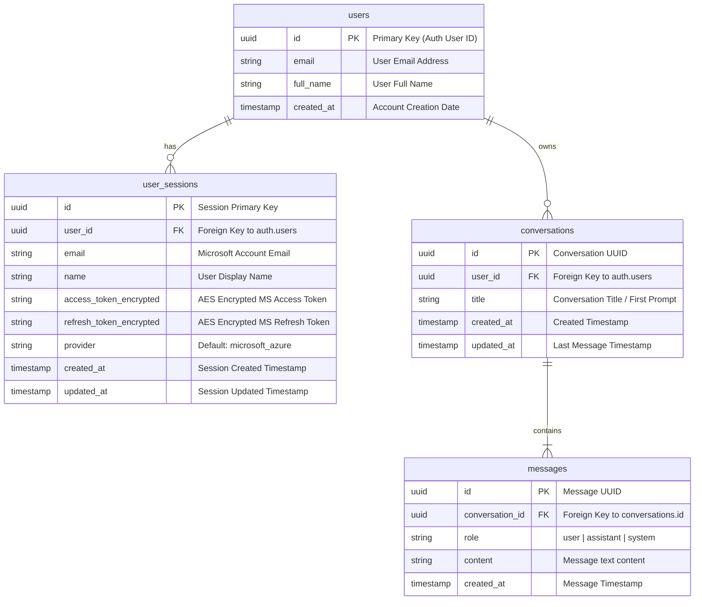

# 📐 Jarvis AI Copilot: System Visualizations & Diagrams

This document contains visual diagrams for the **Jarvis AI Academic Copilot**:
1. **Architecture Diagram**: High-level structural components & system layers.
2. **Flow Diagram (Sequence Diagram)**: Step-by-step data execution pipeline.
3. **Entity Relationship (ER) Diagram**: Supabase database schema and relationships.

---

## 🏗️ 1. System Architecture Diagram

---

## 🔄 2. End-to-End Sequence Flow Diagram

---

## 🗄️ 3. Entity Relationship (ER) Diagram (Database Schema)

