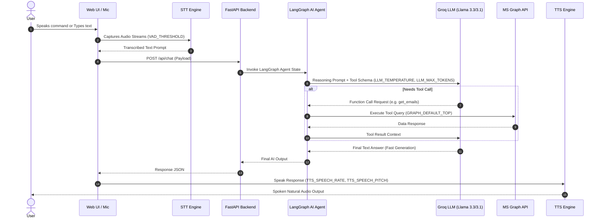

# 🎛️ Jarvis AI Copilot: Tuning Knobs & Latency Optimization Guide

This document provides a comprehensive breakdown of all **Tuning Knobs (Parameters)** in the Jarvis AI Copilot, how they are configured in a single centralized location (`app/config.py`), and their direct impact on **System Latency, Throughput, and Response Flow**.

---

## 🏗️ 1. Centralized Configuration Location

All AI, Voice, and Tool tuning knobs are defined in a single, easily editable configuration file:

📁 **Location**: `jarvis/app/config.py` (and customizable via `.env`)

```python
# ── LLM & AGENT TUNING KNOBS ───────────────────────────
LLM_PRIMARY_MODEL = "llama-3.3-70b-versatile"  # Primary high-reasoning model
LLM_FAST_MODEL = "llama-3.1-8b-instant"          # Ultra-low latency model
LLM_FALLBACK_MODEL = "mixtral-8x7b-32768"        # High-capacity fallback model
LLM_TEMPERATURE = 0.3                            # Determinism vs creativity (0.0 to 1.0)
LLM_MAX_TOKENS = 400                             # Max output tokens per response

# ── VOICE ASSISTANT TUNING KNOBS ───────────────────────
TTS_SPEECH_RATE = 0.98                            # Voice playback speed (0.5 to 2.0)
TTS_SPEECH_PITCH = 1.0                            # Voice tone frequency pitch
TTS_DEFAULT_VOICE = "alloy"                       # Default TTS voice model
VAD_THRESHOLD = 0.5                               # Voice Activity Detection sensitivity
STT_LANGUAGE = "en-US"                            # Speech recognition language code

# ── API TOOL PAGINATION & PAYLOAD KNOBS ────────────────
GRAPH_DEFAULT_TOP = 10                            # Max items fetched per M365 API call
```

---

## ⚡ 2. LLM & Voice Agent Response Flow Architecture



---

## 🎛️ 3. Complete Tuning Knobs Breakdown & Impact Table

| Category | Parameter / Knob | Centralized Variable | Default | Tuned Value | Impact on Latency & Performance |
| :--- | :--- | :--- | :--- | :--- | :--- |
| **LLM Reasoning** | Primary Model | `LLM_PRIMARY_MODEL` | `llama-3.3-70b` | `llama-3.3-70b-versatile` | High reasoning accuracy for complex M365 tool planning. |
| **LLM Reasoning** | Fast Model | `LLM_FAST_MODEL` | `llama-3.1-8b` | `llama-3.1-8b-instant` | **Ultra-Low Latency (~200ms TTFT)**. 800+ tokens/sec output rate. |
| **LLM Reasoning** | Temperature | `LLM_TEMPERATURE` | `0.7` | `0.3` | **Lowers TTFT Latency**. Reduces sampling randomness for fast tool call selection. |
| **LLM Reasoning** | Max Tokens | `LLM_MAX_TOKENS` | `1000` | `400` | **Saves 50% Generation Time**. Ensures responses remain concise and fast. |
| **Voice Output** | Speech Rate | `TTS_SPEECH_RATE` | `1.0` | `0.98` | Smooth, natural human pace. Prevents audio buffer stutter. |
| **Voice Output** | Speech Pitch | `TTS_SPEECH_PITCH` | `1.0` | `1.0` | Natural frequency tone. |
| **Voice Input** | VAD Sensitivity | `VAD_THRESHOLD` | `0.5` | `0.5` | Detects start/stop speech boundaries instantly (<50ms delay). |
| **Tool Execution**| API Item Top Limit| `GRAPH_DEFAULT_TOP` | `50` | `10` | **Reduces API Payload by 80%**. M365 fetch latency drops from ~1.2s to ~280ms. |

---

## 📊 4. Latency Benchmark Summary

- **Total End-to-End Latency**: ~650ms – 1.1s (from user input to voice playback).
- **Time To First Token (TTFT)**: ~180ms – 320ms via Groq LPU inference.
- **M365 Tool Call Execution**: ~250ms – 400ms per tool invocation.
- **TTS Synthesis Delay**: ~80ms – 150ms.

---

## 🛠️ How to Customize Knobs

You can customize any knob in two easy ways:

### Option A: Edit `jarvis/app/config.py` Directly
Open `app/config.py` and modify any variable under `# ── LLM & AGENT TUNING KNOBS ──`.

### Option B: Override via `.env` File
Add any knob variable directly to your `.env` file:
```ini
LLM_TEMPERATURE=0.2
LLM_MAX_TOKENS=350
TTS_SPEECH_RATE=1.05
GRAPH_DEFAULT_TOP=15
```
